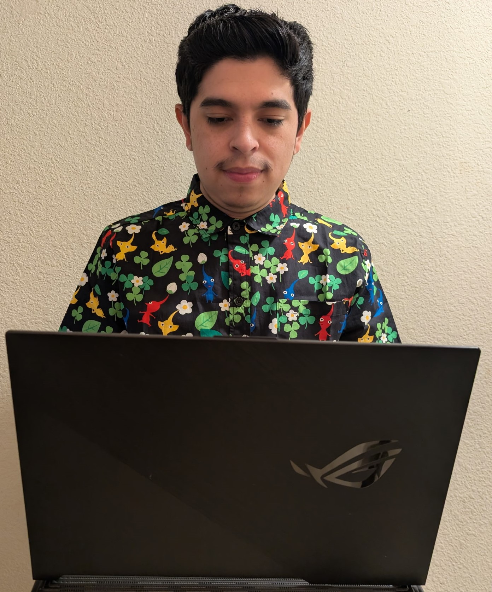

<link rel="stylesheet" type='text/css' href="https://cdn.jsdelivr.net/gh/devicons/devicon@latest/devicon.min.css" />

  

   <b>About Me     </b> 
  
<b>Greetings!</b>

  
  My name is Martin Uribe Hernandez, a programmer from small town Hollister, California. I graduated from UCSC with a Bachelor of Science in 
<a class="grey-link" href="https://catalog.ucsc.edu/current/general-catalog/academic-units/baskin-engineering/computer-science-and-engineering/computer-science-bs"> Computer Science</a>. In my free time, I am developing a game under a small independent video game studio, <i> Dropped Mustard Games</i>, as the sole game programmer.  

I am interested in work, experience or any opportunities to collaborate with a team within this field. 

  

    

        
      

  

<!-- Tools I have experience with -->

    

        <h2>Languages</h2>
        <i class="devicon-python-plain colored"></i>
        <i class="devicon-cplusplus-plain colored"></i>
        <i class="devicon-javascript-plain colored"></i>
        <i class="devicon-kotlin-plain colored"></i>
        <i class="devicon-swift-plain colored"></i>
        
 Programming languages with the most experience. 

    

    

        <h2>Front-End</h2>
        <i class="devicon-flutter-plain colored"></i>
        <i class="devicon-react-original colored"></i>
        <i class="devicon-html5-plain-wordmark colored"></i>
        <i class="devicon-css3-plain-wordmark colored"></i>
        
Technologies and progrmaming languages I am familiar with for front-end development

    

    

        <h2>Back-End</h2>
        <i class="devicon-typescript-plain colored"></i>
        <i class="devicon-postgresql-plain-wordmark colored"></i>
        
 Technologies and programming languages I am familiar with for back-end development

    

        

        <h2>Video Game Programming</h2>
        <i class="devicon-unity-plain colored"></i>
        <i class="devicon-blender-original colored"></i>
        <i class="devicon-csharp-plain colored"></i>
        
 Technologies and programming languages for Game Programming I have experience with 

    

        

        <h2>Tools</h2>
        <i class="devicon-git-plain-wordmark colored"></i>
        <i class="devicon-visualstudio-plain colored"></i>
        <i class="devicon-github-plain-wordmark colored"></i>
        <i class="devicon-figma-plain colored"></i>
        
 Tools for version control and code editing I have used. 

    

